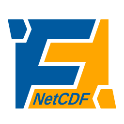

:html_theme.sidebar_secondary.remove: true

============
FINAM NetCDF
============

NetCDF reader and writer components for the `FINAM <https://finam.pages.ufz.de/>`_ model coupling framework.

Quickstart
----------

Installation:

.. code-block:: bash

    pip install finam-netcdf

For available components, see the :doc:`api/index`.

Usage
-----

See the `example scripts <https://git.ufz.de/FINAM/finam-netcdf/-/tree/main/examples>`_
in the GitLab repository for fully functional usage examples.

Readers
^^^^^^^

The package provides two types of NetCDF reader components:

* :class:`.NetCdfStaticReader` for reading starting conditions during initialization
* :class:`.NetCdfReader` for reading time series of rasters

Both components can read multiple variables from a single dataset.

:class:`.NetCdfStaticReader`
""""""""""""""""""""""""""""

Reads once during initialization of the coupling setup.
A time slice must be provided if the variable is actually temporal.

.. testcode:: NetCdfStaticReader

    from finam_netcdf import Variable, NetCdfStaticReader

    path = "tests/data/lai.nc"
    reader = NetCdfStaticReader(path, [Variable("lai", fixed={"time": 0})])

:class:`.NetCdfReader`
""""""""""""""""""""""

Reads once on each time step, where time steps are defined by the time dimension provided by the dataset (but see also `Time manipulation`).

.. testcode:: NetCdfReader

    from finam_netcdf import NetCdfReader

    path = "tests/data/lai.nc"
    reader = NetCdfReader(path, ["lai"])

When multiple variables/layers are read, they must all use the same time dimension (i.e. they must have common time steps).

Time manipulation
"""""""""""""""""

In some cases, it may not be desirable to use time data from a dataset directly.
The example dataset `lai.nc` used above contains 12 LAI rasters along the temporal axis, one for each month of the year.
This example cycles through the 12 rasters every year:

.. testcode:: time-manipulation

    from datetime import datetime
    from finam_netcdf import NetCdfReader

    start = datetime(2000, 1, 1)

    def to_time_step(tick, _last_time, _last_index):
        year = start.year + tick // 12
        month = 1 + tick % 12
        return datetime(year, month, 1), tick % 12

    path = "tests/data/lai.nc"
    reader = NetCdfReader(path, ["lai"], time_callback=to_time_step)

Outputs
"""""""

Component outputs can be accessed by the keys used for `outputs`, e.g. for linking:

.. code-block:: Python

    reader.outputs["lai"] >> viewer.inputs["Grid"]

Writers
^^^^^^^

The package provides two types of NetCDF writer components:

* :class:`.NetCdfTimedWriter` for writing in predefined, fixed time intervals
* :class:`.NetCdfPushWriter` for writing whenever new data becomes available

Both components can write multiple variables to a single dataset.

:class:`.NetCdfTimedWriter`
"""""""""""""""""""""""""""

Writes time slices regularly, irrespective of input time steps.

.. testcode:: NetCdfTimedWriter

    from datetime import timedelta
    from finam_netcdf import NetCdfTimedWriter

    path = "tests/data/out.nc"
    reader = NetCdfTimedWriter(path, ["lai"], step=timedelta(days=1))

:class:`.NetCdfPushWriter`
""""""""""""""""""""""""""

Writes time slices as soon as new data becomes available to the inputs.
Note that all input data sources must have the same time step!

.. testcode:: NetCdfPushWriter

    from finam_netcdf import NetCdfPushWriter

    path = "tests/data/out.nc"
    reader = NetCdfPushWriter(path, ["lai"])

API References
--------------

Information about the API of FINAM-NetCDF.

.. toctree::
    :hidden:
    :maxdepth: 1

    self

.. toctree::
    :maxdepth: 1

    api/index

About
-----

Further information about licensing, the developers team and the changelog of FINAM-NetCDF.

.. toctree::
  :maxdepth: 2

  about/index

License
^^^^^^^

LGPLv3, Copyright © 2021-2025, the FINAM developers from Helmholtz-Zentrum für Umweltforschung GmbH - UFZ. All rights reserved.
